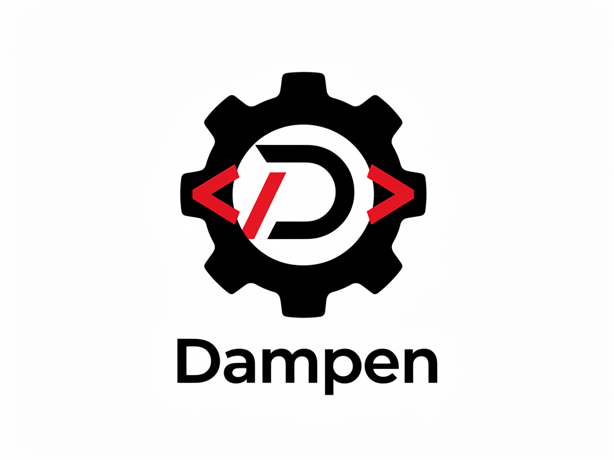
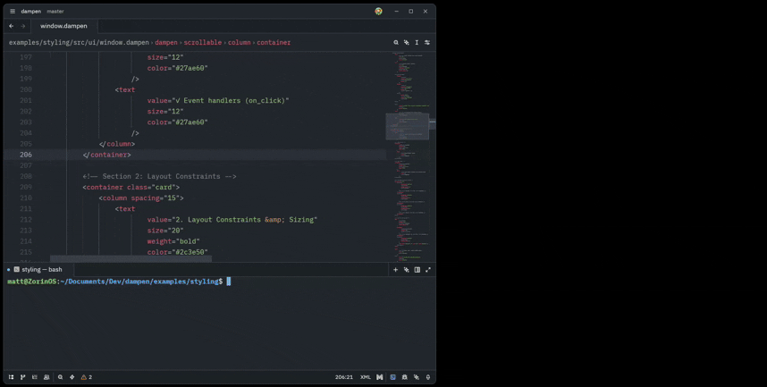

<div align="center">

  

# Dampen

[](https://crates.io/crates/dampen-cli)
[](https://docs.rs/dampen-core)
[](LICENSE-MIT)
[](https://rust-lang.org)

**Declarative UI framework for Rust with Iced backend, hot reloading and advanced styling.**

Dampen allows you to define your user interface in XML and render it via Iced.

  

</div>

---

> **⚠️ DEVELOPMENT STATUS**
> 
> **Dampen is currently under active development and is NOT ready for production use.**
> 
> The framework is functional and can be tested for experimentation, learning, and contributing to its development. However, the API is unstable and subject to breaking changes. Features may be incomplete, and there may be bugs or performance issues.
> 
> **Use Dampen for:**
> - ✅ Experimentation and learning
> - ✅ Contributing to development
> - ✅ Testing and providing feedback
> - ✅ Prototype applications
> 
> **Do NOT use Dampen for:**
> - ❌ Production applications
> - ❌ Mission-critical systems
> - ❌ Applications requiring API stability
> 
> We welcome your feedback and contributions! See [CONTRIBUTING.md](docs/CONTRIBUTING.md) to get involved.

---

## Features

- ✅ **Declarative XML definitions**
- ✅ **Advanced styling system** (themes, classes, state styles)
- ✅ **Responsive design** with breakpoints (mobile, tablet, desktop)
- ✅ **Type-safe event handlers**
- ✅ **Expression evaluation** in XML attributes
- ✅ **Full Iced widget support** (text, buttons, inputs, layouts, etc.)
- ✅ **Radio button groups** with single-selection behavior
- ✅ **Data binding** with `#[derive(UiModel)]`
- ✅ **CLI validation** tools for syntax checking
- ✅ **Dual-mode architecture**: Hot-reload for development, codegen for production
- ✅ **Hot-reload support**: See UI changes instantly without recompiling

## Installation

```bash
cargo install dampen-cli
```

## Quick Start

### Create a New Project

Use the CLI command to scaffold a new Dampen project:

```bash
# Create a new project
dampen new my-app

# Navigate to the project
cd my-app

# Run the application
dampen run
```

## Project Structure

The `dampen new` command creates a complete project structure:

```
my-app/
├── Cargo.toml              # Project dependencies
├── README.md               # Getting started guide
├── build.rs                # Code generation (XML → Rust)
├── src/
│   ├── main.rs             # Application entry point
│   └── ui/
│       ├── mod.rs          # UI module exports
│       ├── window.rs       # Model and handlers with #[dampen_ui]
│       └── window.dampen   # Declarative UI definition (XML)
└── tests/
    └── integration.rs      # Integration tests
```

**Key Files:**

| File | Description |
|------|-------------|
| `src/ui/window.dampen` | XML UI definition with widgets, bindings, handlers |
| `src/ui/window.rs` | Model with `#[derive(UiModel)]`, handler registry |
| `src/main.rs` | Application orchestration (view, update) |
| `build.rs` | Compiles `.dampen` files to Rust code |

**Generated UI Example:**

```xml
<?xml version="1.0" encoding="UTF-8" ?>
<dampen>
    <column padding="40" spacing="20">
        <text value="Hello, Dampen!" size="32" weight="bold" />
        <button label="Click me!" on_click="greet" />
        <text value="{message}" size="24" />
    </column>
</dampen>
```

### Project Validation

```bash
# Validate XML syntax and widget names
dampen check

# Build the project
dampen build

# Inspect generated IR
dampen inspect src/ui/window.dampen
```

## Advanced Features

### Data Binding

```rust
#[derive(UiModel, Default, Serialize, Deserialize, Clone)]
struct Model {
    count: i32,
    name: String,
    items: Vec<TodoItem>,
}

#[derive(Debug, Clone, Serialize, Deserialize)]
struct TodoItem {
    id: usize,
    text: String,
    completed: bool,
}
```

### Type-Safe Event Handlers

```rust
#[ui_handler]
fn increment(model: &mut Model) {
    model.count += 1;
}

#[ui_handler]
fn add_item(model: &mut Model, text: String) {
    model.items.push(TodoItem {
        id: model.next_id,
        text,
        completed: false,
    });
    model.next_id += 1;
}

#[ui_handler]
fn toggle_item(model: &mut Model, id: usize) {
    if let Some(item) = model.items.iter_mut().find(|i| i.id == id) {
        item.completed = !item.completed;
    }
}
```

### Advanced Theming System

```xml
<themes>
    <theme name="light">
        <palette 
            primary="#3498db" 
            secondary="#2ecc71"
            background="#ecf0f1"
            text="#2c3e50" />
        <typography font_family="Inter, sans-serif" font_size_base="16" />
        <spacing unit="8" />
    </theme>
    
    <theme name="dark">
        <palette 
            primary="#5dade2" 
            secondary="#52be80"
            background="#2c3e50"
            text="#ecf0f1" />
        <typography font_family="Inter, sans-serif" font_size_base="16" />
        <spacing unit="8" />
    </theme>
</themes>

<global_theme name="light" />
```

### Reusable Style Classes

```xml
<styles>
    <style name="btn_primary">
        <base
            background="#3498db"
            color="#ffffff"
            padding="8 16"
            border_radius="6"
            border_width="0" />
        <hover background="#5dade2" />
        <active background="#2874a6" />
        <disabled opacity="0.5" />
    </style>
    
    <style name="btn_danger">
        <base
            background="#e74c3c"
            color="#ffffff"
            padding="8 16"
            border_radius="6" />
        <hover background="#ec7063" />
    </style>
</styles>

<button class="btn_primary" label="Submit" on_click="submit" />
<button class="btn_danger" label="Delete" on_click="delete" />
```

### Responsive Design with Breakpoints

```xml
<column 
    mobile:spacing="10"
    tablet:spacing="15"
    desktop:spacing="20">
    <text 
        mobile:size="18"
        desktop:size="32"
        value="Responsive text" />
</column>
```

### Available Widgets

| Widget | Description | Main Attributes |
|--------|-------------|----------------|
| `text` | Text display | value, size, weight, color |
| `button` | Interactive button | label, on_click, enabled, class |
| `text_input` | Text input field | value, on_input, placeholder |
| `checkbox` | Checkbox | checked, on_toggle |
| `toggler` | Toggle switch | active, on_toggle, label |
| `pick_list` | Dropdown list | options, selected, on_select |
| `radio` | Radio button | label, value, selected, on_select |
| `column` | Vertical layout | spacing, padding, align |
| `row` | Horizontal layout | spacing, padding, align |
| `scrollable` | Scrollable area | width, height |
| `container` | Container | padding, width, height |
| `for` | Dynamic loop | each, in |
| `grid` | Grid layout | columns, spacing |
| `progress_bar` | Progress bar | min, max, value |
| `svg` | SVG image | path, width, height |
| `tooltip` | Tooltip | message, position |

## Dual-Mode Architecture

Dampen supports two compilation modes optimized for different use cases:

### Interpreted Mode (Development)

**Enabled by default in development builds**

- ✅ **Fast iteration**: Hot-reload UI changes without recompiling
- ✅ **Runtime parsing**: XML loaded and parsed at application startup
- ✅ **Instant feedback**: See changes in <300ms
- ✅ **Debugging friendly**: Error overlays with detailed messages

```bash
# Development mode (automatic)
dampen run

# Explicit interpreted mode
dampen run --features interpreted
```

**Hot-reload example:**

```rust
use dampen_dev::watch_files;

fn subscription(app: &App) -> Subscription<Message> {
    watch_files(vec![PathBuf::from("src/ui/window.dampen")], "xml")
        .map(|_| Message::ReloadUI)
}
```

### Codegen Mode (Production)

**Enabled by default in release builds**

- ✅ **Zero runtime overhead**: All XML parsed at compile time
- ✅ **Optimal performance**: Direct widget construction
- ✅ **Smaller binaries**: No runtime parser included
- ✅ **Build-time validation**: Catch errors before deployment

```bash
# Production build (automatic codegen)
dampen release

# Debug build with codegen
dampen build
```

**How it works:**

1. `build.rs` processes `.dampen` files at compile time
2. Generated Rust code embedded via macros
3. No runtime XML parsing required

### Mode Selection

Mode selection is **automatic** based on build profile:

| CLI Command | Mode | Use Case |
|-------------|------|----------|
| `dampen run` | Interpreted | Development with hot-reload |
| `dampen build` | Codegen | Debug builds with codegen |
| `dampen release` | Codegen | Production deployments (optimized) |
| `dampen test` | Interpreted | Fast test iteration |

**Advanced usage:**

```bash
# Enable additional features
dampen release --features tokio,logging

# Run tests in release mode
dampen test --release

# Verbose output
dampen build -v
```

### Migration Guide

Migrating existing projects to dual-mode architecture? See our [Migration Guide](docs/migration/dual-mode.md) for step-by-step instructions.

## Architecture

### Crate Structure

```
crates/
├── dampen-core/           # XML parser, IR, traits (no Iced dependency)
├── dampen-macros/         # Macros #[derive(UiModel)], #[dampen_ui]
├── dampen-iced/           # Iced backend implementation
├── dampen-dev/            # Development mode tooling for Dampen
└── dampen-cli/            # Developer CLI (build, check, inspect)

```

### Core Principles

1. **Declarative-First**: XML is the source of truth for UI structure
2. **Type Safety**: No type erasure for messages/state
3. **Production Mode**: Static code generation for deployments
4. **Backend-Agnostic**: Core crate has no Iced dependency
5. **Test-First**: TDD for all features


## Examples

See the [examples/](examples/) directory for progressive demonstrations:

| Example | Features |
|---------|----------|
| **hello-world** | Minimal static UI rendering |
| **counter** | Interactive event handlers |
| **todo-app** | Complete data binding with lists |
| **styling** | Themes, classes, state styles |
| **responsive** | Responsive design with breakpoints |
| **settings** | Multiple views and navigation |
| **widget-showcase** | Demonstration of all widgets |

## CLI Commands

```bash
# Generate production code
dampen build --ui ui --output src/ui_generated.rs

# Validate UI files without running
dampen check --ui ui

# Inspect IR or generated code
dampen inspect --file ui/main.dampen
dampen inspect --file ui/main.dampen --codegen --handlers increment,decrement
```

## Documentation

- **[API Documentation](https://docs.rs/dampen-core)** - Complete Rustdoc
- **[XML Schema Reference](docs/XML_SCHEMA.md)** - Widgets and attributes
- **[Styling Guide](docs/STYLING.md)** - Themes, classes, state styles
- **[Examples](examples/README.md)** - Progressive example projects

## Contributing

We welcome contributions from the community! Whether you're fixing bugs, adding features, improving documentation, or reporting issues, your help is appreciated.

**Before contributing, please read our [Contributing Guide](docs/CONTRIBUTING.md)** which covers:

- Code of conduct and community standards
- Setting up your development environment
- Coding standards and style guidelines
- Testing requirements (TDD is mandatory)
- Pull request process and commit message format
- How to report issues and request features

**Quick start for contributors:**

```bash
# Fork and clone the repository
git clone https://github.com/YOUR_USERNAME/dampen.git
cd dampen

# Build and test
cargo build --workspace
cargo test --workspace
cargo clippy --workspace -- -D warnings

# Try the examples
dampen run -p hello-world
```

All contributions must:
- ✅ Pass all tests (`cargo test --workspace`)
- ✅ Pass clippy lints (`cargo clippy --workspace -- -D warnings`)
- ✅ Be properly formatted (`cargo fmt --all`)
- ✅ Include tests for new functionality
- ✅ Update documentation as needed

See [docs/CONTRIBUTING.md](docs/CONTRIBUTING.md) for complete details.

## License

This project is dual-licensed under Apache 2.0 or MIT, at your option.

---

**Built with ❤️ using Rust and Iced**
