# Automation & CI/CD

Ce document décrit l'infrastructure d'automatisation mise en place pour Dampen.

## 🔄 Workflows GitHub Actions

### CI (Continuous Integration)

**Fichier :** `.github/workflows/ci.yml`

**Déclenché sur :**
- Push sur `main`, `develop`, ou branches de feature
- Pull Requests vers `main` ou `develop`

**Jobs :**

1. **Test Suite**
   - Lance tous les tests du workspace
   - Vérifie le formatage (`cargo fmt`)
   - Vérifie clippy (`cargo clippy`)

2. **MSRV Check**
   - Vérifie la compilation avec Rust 1.75 (MSRV)

3. **Coverage**
   - Génère un rapport de couverture de code
   - Upload vers Codecov

4. **Documentation**
   - Génère la documentation
   - Vérifie qu'il n'y a pas de warnings

### Release (Publication automatique)

**Fichier :** `.github/workflows/release.yml`

**Déclenché sur :**
- Création d'une GitHub Release

**Processus :**

```mermaid
graph TD
    A[GitHub Release créée] --> B[Vérifier version tag = Cargo.toml]
    B --> C[Lancer les tests]
    C --> D[Publier dampen-core]
    D --> E[Attendre 30s]
    E --> F[Publier dampen-macros]
    F --> G[Attendre 30s]
    G --> H[Publier dampen-runtime]
    H --> I[Attendre 30s]
    I --> J[Publier dampen-iced]
    J --> K[Attendre 30s]
    K --> L[Publier dampen-cli]
    L --> M[✅ Release complète]
```



**Détails :**
- Publie les crates dans l'ordre de dépendance
- Attend 30 secondes entre chaque publication pour l'indexation
- Utilise le secret `CARGO_TOKEN` pour l'authentification
- Crée un résumé dans l'interface GitHub Actions

## 🤖 Versioning automatique

### Workspace Dependencies

Toutes les versions sont gérées dans `Cargo.toml` (racine) :

```toml
[workspace.package]
version = "0.1.0"  # ← Version unique pour toutes les crates

[workspace.dependencies]
dampen-core = { path = "./crates/dampen-core", version = "0.1.0" }
iced = { version = "0.14", ... }
serde = { version = "1.0", ... }
# ...
```

Toutes les crates utilisent `{ workspace = true }` :

```toml
[dependencies]
dampen-core = { workspace = true }
iced = { workspace = true }
```

### Template Version Injection

**Build Script :** `crates/dampen-cli/build.rs`

Extrait automatiquement les versions du workspace et les expose comme variables d'environnement :

```rust
// Pendant la compilation de dampen-cli
env!("CARGO_PKG_VERSION")    // → "0.1.0"
env!("ICED_VERSION")          // → "0.14"
env!("SERDE_VERSION")         // → "1.0"
```

**Génération de template :** `crates/dampen-cli/src/commands/new.rs`

Utilise ces variables pour générer `Cargo.toml` des nouveaux projets :

```toml
# Template généré automatiquement
[dependencies]
dampen-core = "0.1.0"    # ← Injecté depuis CARGO_PKG_VERSION
iced = "0.14"            # ← Injecté depuis ICED_VERSION
serde = { version = "1.0", ... }  # ← Injecté depuis SERDE_VERSION
```

**Avantage :** Un seul endroit à modifier pour mettre à jour toutes les versions !

## 🚀 Processus de Release

### Workflow complet

```
┌─────────────────────────────────────────┐
│  1. Développement                       │
│  $ git checkout -b feature/new-feature  │
│  $ git commit -m "feat: new feature"    │
│  $ git push                             │
└──────────────┬──────────────────────────┘
               │
               ▼
┌─────────────────────────────────────────┐
│  2. Pull Request                        │
│  - CI vérifie tests/clippy/fmt          │
│  - Review de code                       │
│  - Merge vers main                      │
└──────────────┬──────────────────────────┘
               │
               ▼
┌─────────────────────────────────────────┐
│  3. Préparation Release                 │
│  $ ./scripts/release.sh 0.2.0           │
│  - Vérifie tests/clippy/fmt             │
│  - Met à jour Cargo.toml                │
│  - Crée commit + tag                    │
└──────────────┬──────────────────────────┘
               │
               ▼
┌─────────────────────────────────────────┐
│  4. Push vers GitHub                    │
│  $ git push origin main                 │
│  $ git push origin v0.2.0               │
└──────────────┬──────────────────────────┘
               │
               ▼
┌─────────────────────────────────────────┐
│  5. Créer GitHub Release                │
│  - Aller sur GitHub                     │
│  - Créer release pour tag v0.2.0        │
│  - Ajouter release notes                │
└──────────────┬──────────────────────────┘
               │
               ▼
┌─────────────────────────────────────────┐
│  6. Publication Automatique (CI/CD)     │
│  - GitHub Action se déclenche           │
│  - Publie toutes les crates sur crates.io│
│  - Génère rapport de release            │
└──────────────┬──────────────────────────┘
               │
               ▼
┌─────────────────────────────────────────┐
│  7. ✅ Release Disponible               │
│  - crates.io/crates/dampen-*            │
│  - docs.rs/dampen-*                     │
│  - cargo install dampen-cli             │
└─────────────────────────────────────────┘
```

### Scripts disponibles

**`scripts/release.sh`** - Script de release automatisé

```bash
./scripts/release.sh 0.2.0
```

Effectue toutes les vérifications et prépare la release.

## 🔐 Secrets GitHub

### CARGO_TOKEN

**Requis pour :** Publication sur crates.io

**Configuration :**
1. Obtenir un token sur [crates.io/settings/tokens](https://crates.io/settings/tokens)
2. Ajouter dans GitHub : `Settings` → `Secrets` → `Actions`
3. Nom : `CARGO_TOKEN`

## 📊 Monitoring

### Status Badges

Ajoutez ces badges dans `README.md` :

```markdown


```

### Vérifications post-release

Après une release, vérifiez :

- ✅ [GitHub Actions](https://github.com/mattdef/dampen/actions) - Toutes les étapes sont vertes
- ✅ [crates.io](https://crates.io/crates/dampen-cli) - Version visible
- ✅ [docs.rs](https://docs.rs/dampen-cli) - Documentation générée
- ✅ Installation : `cargo install dampen-cli` fonctionne

## 🛠️ Maintenance

### Mettre à jour une dépendance

```bash
# 1. Modifier Cargo.toml (workspace)
vim Cargo.toml

# 2. Tester
cargo test --workspace

# 3. Les nouveaux projets utiliseront automatiquement la nouvelle version
```

### Ajouter une nouvelle crate au workspace

1. Créer la crate dans `crates/`
2. Ajouter dans `Cargo.toml` (workspace members)
3. Ajouter dans `.github/workflows/release.yml`
4. Mettre à jour `scripts/release.sh` si nécessaire

## 📚 Documentation

- [Guide de Release](./RELEASE.md) - Instructions détaillées pour les releases
- [Scripts README](../scripts/README.md) - Documentation des scripts
- [CHANGELOG](../CHANGELOG.md) - Historique des versions

## 🔗 Liens utiles

- [GitHub Actions Documentation](https://docs.github.com/en/actions)
- [Cargo Publishing Guide](https://doc.rust-lang.org/cargo/reference/publishing.html)
- [Semantic Versioning](https://semver.org/)
- [Keep a Changelog](https://keepachangelog.com/)
